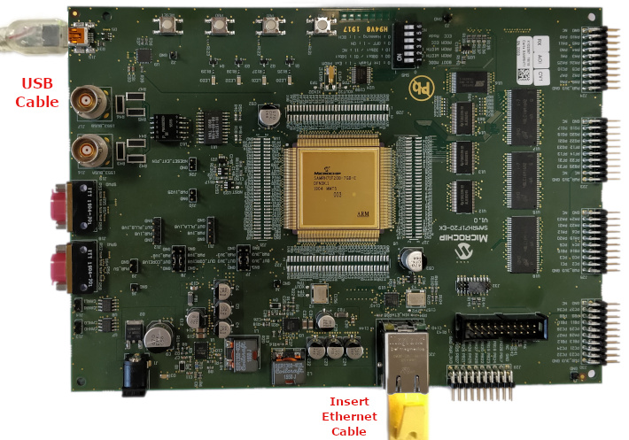

# TCP/IP Berkeley TCP Client Hardware Configuration

This section describes the required default hardware configuration for SAM RH71 Evaluation Kit that can be used for the respective application demonstration.

  * For initial setup, you can refer to the [Getting Started with SAMRH71F20 Evaluation Kit](https://ww1.microchip.com/downloads/en/AppNotes/Getting_Started_with_the_SAMRH71_Microcontroller_DS00003213C.pdf) application note.

  * Set all SW5 DIP Switch to 0.

  * Connect the micro USB cable from the computer to the J15 USB connector on the SAM RH71 Evaluation Kit

  * Establish a connection between the router/switch with the SAM RH71 Evaluation Kit through the RJ45 connector

    
