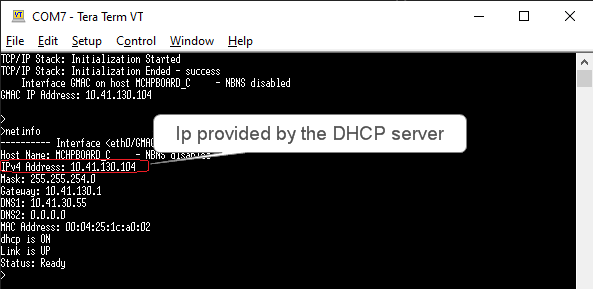
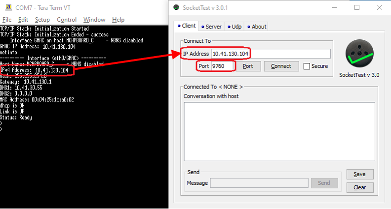
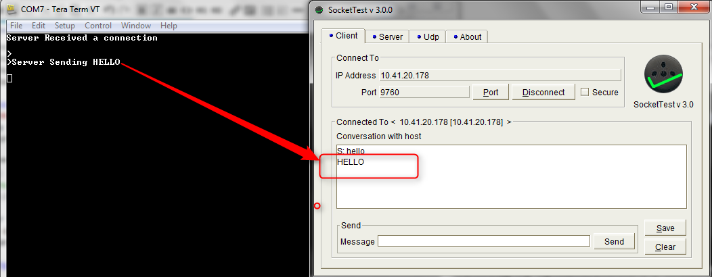
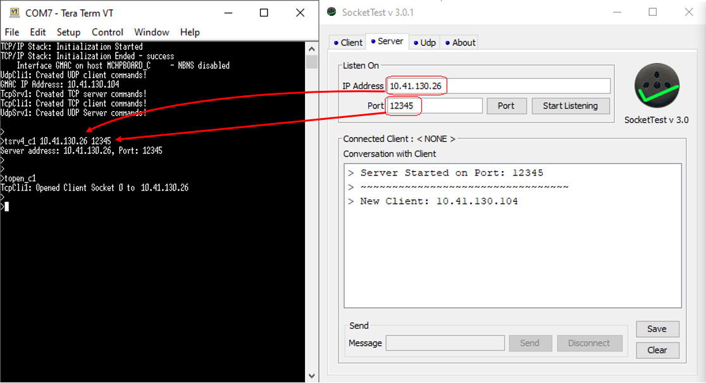

# TCP/IP TCP and UDP Client Server Running Application

The Client Server configuration use combination of both TCP and UDP sockets for both client and server communication.

## MPLAB X IDE Project
This table list the name and location of the MPLAB X IDE project folder for the demonstration.

|Project Name|  Target Device|  Target Development Board | Description  |
|:-------------:|:---------:|:---------:|:---------:|
|sam_rh71_ek.X | ATSAMRH71F20C | SAMRH71F20-EK | Demonstrates the TCP/IP TCP and UDP Client Server on development board with ATSAMRH71F20C device. This implementation is based on FreeRTOS.  |

## Running The Demonstration

1. Configure the Development Board as given  **[Configure Hardware](readme_hardware_configuration.md)**.

2. Make the demonstration setup as shown [Network Setup](../../readme.md).

3. Build and download the demonstration project on the target board.

4. Connect the board UART connection:

    1. A virtual COM port will be detected on the computer, when the USB cable is connected to USB-UART connector.

    2. Open a standard terminal application on the computer (like Hyper-terminal or Tera Term) and configure the virtual COM port.

    3. Set the serial baud rate to 115200 baud in the terminal application.

    4. See that the initialization prints on the serial port terminal.

    5. When the DHCP client is enabled in the demonstration, wait for the DHCP server to assign an IP address for the development board. This will be printed on the serial port terminal.

		* Alternatively: Use the Announce service or ping to get the IP address of the board.

        * Run **tcpip_discoverer.jar** to discover the IPv4 and IPv6 address for the board.
        
5. Execution :

    1. Once the demonstration starts executing,  we can observe the current IP settings at the Tera Term terminal port.

    2. Using "help" will display the available commands that can be used for this demo.

    3. The application can create 4 separate connections, each one running in its own thread:
        * A TCP client connection
        * A TCP server connection
        * A UDP client connection
        * A UDP server connection

    4. Each connection has its own set of commands.

        * They can open or close the sockets, send messages to the socket they are connected to, they can display the received messages, etc.
        
        * Using your preferred networking tools on the PC side ( netcat, Packet Sender, Hercules, python scripts, etc., etc. ) create sockets that talk to the ones opened by the client server application.
        
        * This way you can exchange data with any/all of the communication threads that the demonstration creates.

    5. After the successful broad bring up, the console output becomes

        

    6.  For TCP Server test, the TCP Client application is required to run on the computer (SocketTest, Packet Sender etc). In this demonstration, we use the program, SocketTest (http://sockettest.sourceforge.net/). This demonstration is tested with **SocketTest v3.0**.

        * Open the TCP server socket by typing **topen_s1** at the terminal console. This will display the listening port.

        * Open the **SocketTest** software and set the configuration as shown in the following figure.

            

        * Press the Connect button on the **SocketTest** software after setting the configuration. The serial terminal indicates that the connection has been established.
        
        * Type any message in the message box of the **SocketTest** program, and press the Send button. The Server running on the development board will echo back the message to the **SocketTest** program.

            

    7. For TCP Client test, the TCP Server application is required to run on the computer (SocketTest, Packet Sender etc). In this demonstration, we use the program, SocketTest (http://sockettest.sourceforge.net/). This demonstration is tested with **SocketTest v3.0**.

        * Open the **SocketTest** software and configure a TCP server by setting the computer IP address and a listening port. Then start the server by pressing **Start Listening** button.

        * Set the TCP client options (Address and port) by using the **tsrv4_c1** command at the terminal console as shown in the following figure.

            

        * Open the TCP client socket by typing **topen_c1** at the terminal console.

        * Send messages to the TCP server by typing **tmsg_c1** at the terminal console.

    8. Similarly UDP Server test is also performed using **SocketTest** tool.

        * Open the UDP server socket by typing **uopen_s1** at the terminal console. This will display the listening port.

        * Set the UDP client configuration in the **SocketTest** software, write any message and press the **Send** button. The Server running on the development board will echo back the message to the **SocketTest** program.

    9. For UDP Client test, an UDP server in configured in **SocketTest** tool.

        * Open the **SocketTest** software and configure a UDP server by setting the computer IP address and a listening port. Then start the UDP server by pressing **Start Listening** button.

        * Set the TCP client options (Address and port) by using the **usrv4_c1** command at the terminal console.

        * Open the TCP client socket by typing **uopen_c1** at the terminal console.

        * Send messages to the TCP server by typing **umsg_c1** at the terminal console.
