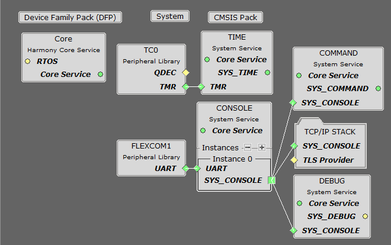
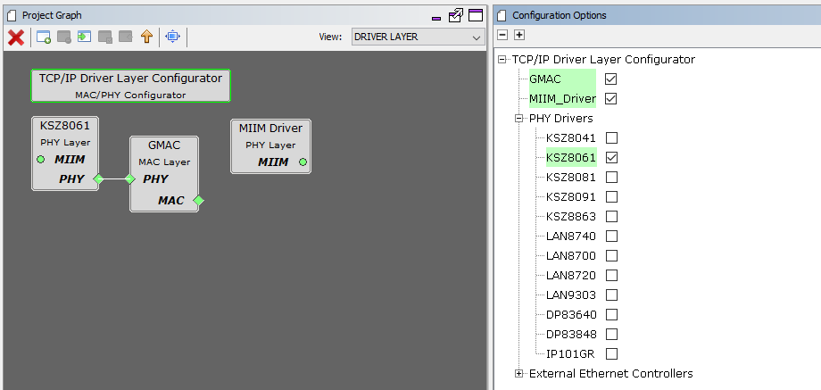

# TCP/IP UDP Server MHC Configuration

The following Project Graph diagram shows the Harmony components included in this application demonstration.

* MHC is launched by selecting **Tools > Embedded > MPLAB® Harmony 3 Configurator** from the MPLAB X IDE, demo project is ready to be configured and regenerated.

* **TCP/IP Root Layer Project Graph**

  The root layer project shows that FLEXCOM1 peripheral is selected to do read and write operation for TCP/IP commands.

  This is the basic configuration with SYS_CONSOLE, SYS_DEBUG and SYS_COMMAND modules. These modules are required for TCP/IP command execution.

  

* **TCP/IP Required Application**

  TCP/IP demo use these application module components for this demo. 
  
  **Announce** module to discover the Microchip devices within a local network.
  
  **DHCP Client** module to discover the IPv4 address from the nearest DHCP Server.
  
  **DNS Client** provides DNS resolution capabilities to the stack.  During these components selection, the required transport and network modules are also selected.

    

* **TCPIP Driver Layer**

  **Internal ethernet driver(GMAC)** is enabled with the external **KSZ8061 PHY driver** library. 

    

  The MIIM Driver supports asynchronous read/write and scan operations for accessing the external PHY registers and notification when MIIM operations have completed.
