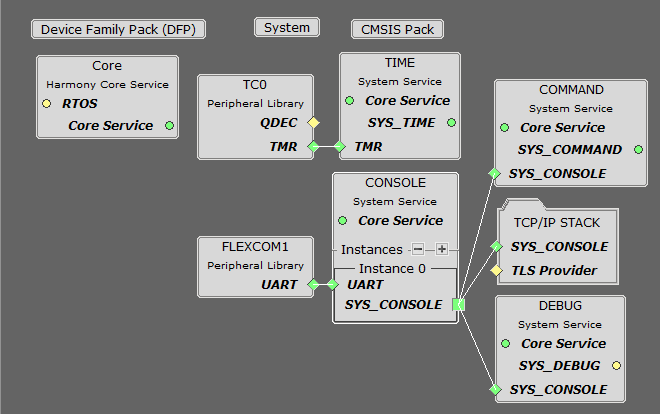

# TCP/IP Berkeley UDP Relay

The Berkeley UDP Relay configuration demonstrates the use of multiple sockets for both sending and receiving. There are three different sub-functions of this application:

-   UDP Relay, which accepts UDP packets on one socket, and sends the packets out on a different socket

-   UDP Relay Client, which generates UDP traffic that is compatible with the UDP Relay Server

-   UDP Relay Server, which receives and checks traffic for a packet count and reports is any packets are dropped

**TCP/IP Berkeley UDP Relay MHC Configuration**

The following Project Graph diagram shows the Harmony components included in the UDP Relay demonstration application.

-   MHC is launched by selecting **Tools \> Embedded \> MPLAB® Harmony 3 Configurator** from the MPLAB X IDE, demo project is ready to be configured and regenerated.

-   **TCP/IP Root Layer Project Graph**

    The root layer project shows that FLEXCOM1 peripheral is selected to do read and write operation for TCP/IP commands.

    This is the basic configuration with SYS\_CONSOLE, SYS\_DEBUG and SYS\_COMMAND modules. These modules are required for TCP/IP command execution.

    

-   **TCP/IP Required Application**

    TCP/IP demo use these application module components for this demo. **Announce** module to discover the Microchip devices within a local network.

    **DHCP Client** module to discover the IPv4 address from the nearest DHCP Server.

    **DNS Client** provides DNS resolution capabilities to the stack.

    **Berkeley API** module provides the Berkeley\_Socket\_Distribution \(BSD\) wrapper to the native Microchip TCP/IP Stack APIs. During this component selection, the required transport and network modules are also selected.

    

-   **TCPIP Driver Layer**

    **Internal ethernet driver\(GMAC\)** is enabled with the external **KSZ8061 PHY driver** library.

    

    The MIIM Driver supports asynchronous read/write and scan operations for accessing the external PHY registers and notification when MIIM operations have completed.

**TCP/IP Berkeley UDP Relay Hardware Configuration**

This section describes the required default hardware configuration for SAM RH71 Evaluation Kit that can be used for the respective application demonstration.

-   For initial setup, you can refer to the [Getting Started with SAMRH71F20 Evaluation Kit](https://ww1.microchip.com/downloads/en/AppNotes/Getting_Started_with_the_SAMRH71_Microcontroller_DS00003213C.pdf) application note.

-   Set all SW5 DIP Switch to 0.

-   Connect the micro USB cable from the computer to the J15 USB connector on the SAM RH71 Evaluation Kit

-   Establish a connection between the router/switch with the SAM RH71 Evaluation Kit through the RJ45 connector

    

**TCP/IP Berkeley UDP Relay Running Application**

**MPLAB X IDE Project**

This table list the name and location of the MPLAB X IDE project folder for the demonstration.

|Project Name|Target Device|Target Development Board|Description|
|------------|-------------|------------------------|-----------|
|sam\_rh71\_ek.X|ATSAMRH71F20C|SAMRH71F20-EK|Demonstrates the Berkeley UDP Relay on development board with ATSAMRH71F20C device. This implementation is based on Bare Metal \( non-RTOS\).|

**Demonstration Commands**

There are several different commands available in the demonstration from the console port:

**General Application Commands**

-   current - Displays the current configuration

-   start - Starts the packet relay service

-   stop - Stops the packet relay service

**Relay Service Configuration**

-   relayhost < host name \> - Sets the host to which packets are to be relayed

-   relayport < port number \> - Sets the port to which packets are to be relayed

-   ipv4port < port number \> - Sets the IPv4 port that the relay server will listen to for packets to relay

-   ipv6port < port number \> - Sets the IPv6 port that the relay server will listen to for packets to relay

**Relay Client Configuration and Commands**

-   relayclienthost < host name \> - Sets the host to which packets are to be sent

-   relayclientiter < number \> - The number of packets to generate

-   relayclientstart - Starts the relay client. This command must be used after the general application start. After a start is called, and the first packet is received by either the relay or the relay server, periodic updates will be sent to the console with information about the number of packets and bytes received.

**Running The Demonstration**

1.  Build and download the demonstration project on the target board.

2.  Connect the board UART connection:

    1.  A virtual COM port will be detected on the computer, when the USB cable is connected to USB-UART connector.

    2.  Open a standard terminal application on the computer \(like Hyper-terminal or Tera Term\) and configure the virtual COM port.

    3.  Set the serial baud rate to 115200 baud in the terminal application.

    4.  See that the initialization prints on the serial port terminal.

    5.  When the DHCP client is enabled in the demonstration, wait for the DHCP server to assign an IP address for the development board. This will be printed on the serial port terminal.

        -   Alternatively: Use the Announce service or ping to get the IP address of the board.

            -   Run **tcpip\_discoverer.jar** to discover the IPv4 and IPv6 address for the board.

3.  Execution:

    -   To test the UDP packet relay with IPv4, send the following commands,

        -   relayclienthost < ip address of the relay client \>

        -   relayclientiter < number of packets to relay \>

        -   relayhost < ip address of the host to which packets are to be relayed \>

        -   relayport < port number to which packets are to be relayed \>

        -   ipv4port < port number to which the relay server listens to, for packets to relay \>

        -   current

        -   start

        -   relayclientstart

    -   Output - The above steps will relay the UDP packet from the host address set using the **relayclienthost** command to the destination address set by the command **relayhost**.

        The relay packet will be received at the port set by command **relayport**.

**Parent topic:**[Harmony 3 TCP/IP Application for SAM RH71 Family](GUID-9F654EF7-6F64-4E62-98D9-7F1BDF366DE8.md)

