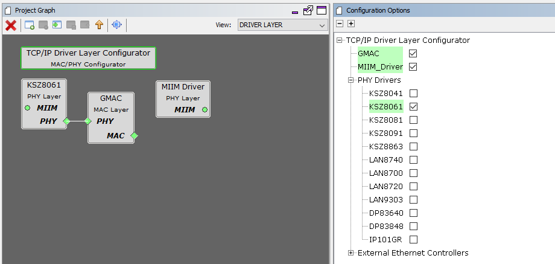
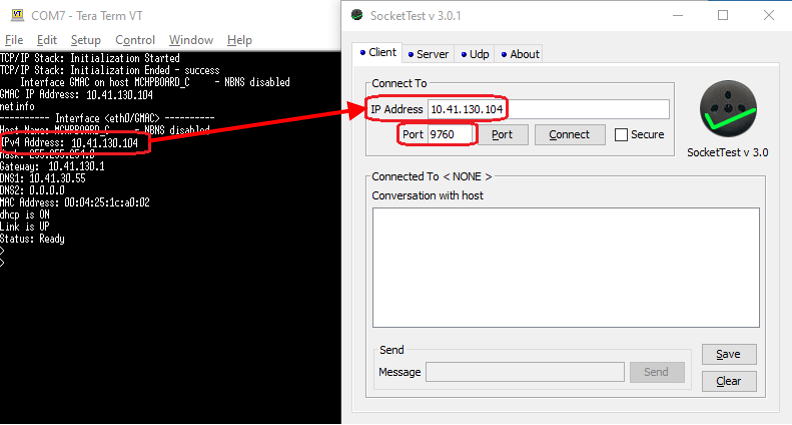

# TCP/IP TCP Client Server

The TCP Client Server configuration demonstrates creating a network client and server that uses the MPLAB Harmony TCP API. This demonstration is a combination of the TCP/IP Client and TCP/IP Server application.

**TCP/IP TCP Client Server MHC Configuration**

The following Project Graph diagram shows the Harmony components included in the TCP Client Server demonstration application.

-   MHC is launched by selecting **Tools \> Embedded \> MPLAB® Harmony 3 Configurator** from the MPLAB X IDE, demo project is ready to be configured and regenerated.

-   **TCP/IP Root Layer Project Graph**

    The root layer project shows that FLEXCOM1 peripheral is selected to do read and write operation for TCP/IP commands.

    This is the basic configuration with SYS\_CONSOLE, SYS\_DEBUG and SYS\_COMMAND modules. These modules are required for TCP/IP command execution.

    

    TCP sockets calculate the ISN using the wolfSSL crypto library.

-   **TCP/IP Required Application**

    TCP/IP demo use these application module components for this demo.

    **Announce** module to discover the Microchip devices within a local network.

    **DHCP Client** module to discover the IPv4 address from the nearest DHCP Server.

    **DNS Client** provides DNS resolution capabilities to the stack.

    

-   **TCPIP Driver Layer**

    **Internal ethernet driver\(GMAC\)** is enabled with the external **KSZ8061 PHY driver** library.

    

    The MIIM Driver supports asynchronous read/write and scan operations for accessing the external PHY registers and notification when MIIM operations have completed.

**TCP/IP TCP Client Server Hardware Configuration**

This section describes the required default hardware configuration for SAM RH71 Evaluation Kit that can be used for the respective application demonstration.

-   For initial setup, you can refer to the [Getting Started with SAMRH71F20 Evaluation Kit](https://ww1.microchip.com/downloads/en/AppNotes/Getting_Started_with_the_SAMRH71_Microcontroller_DS00003213C.pdf) application note.

-   Set all SW5 DIP Switch to 0.

-   Connect the micro USB cable from the computer to the J15 USB connector on the SAM RH71 Evaluation Kit

-   Establish a connection between the router/switch with the SAM RH71 Evaluation Kit through the RJ45 connector

    

**TCP/IP TCP Client Server Running Application**

**MPLAB X IDE Project**

This table list the name and location of the MPLAB X IDE project folder for the demonstration.

|Project Name|Target Device|Target Development Board|Description|
|------------|-------------|------------------------|-----------|
|sam\_rh71\_ek.X|ATSAMRH71F20C|SAMRH71F20-EK|Demonstrates the TCP Client Server on development board with ATSAMRH71F20C device. This implementation is based on Bare Metal \( non-RTOS\).|

**Running The Demonstration**

1.  Build and download the demonstration project on the target board.

2.  Connect the board UART connection:

    1.  A virtual COM port will be detected on the computer, when the USB cable is connected to USB-UART connector.

    2.  Open a standard terminal application on the computer \(like Hyper-terminal or Tera Term\) and configure the virtual COM port.

    3.  Set the serial baud rate to 115200 baud in the terminal application.

    4.  See that the initialization prints on the serial port terminal.

    5.  When the DHCP client is enabled in the demonstration, wait for the DHCP server to assign an IP address for the development board. This will be printed on the serial port terminal.

        -   Alternatively: Use the Announce service or ping to get the IP address of the board.

            -   Run **tcpip\_discoverer.jar** to discover the IPv4 and IPv6 address for the board.

3.  Execution :

    1.  After the successful broad bring up, the console output becomes

        

    2.  For TCP Client test, input the following command from the serial port: **openurl < url \>** - The < url \> argument must be a fully formed URL; for instance, "http://www.microchip.com/".

        For this above URL , the DNS module will make a DNS query. Then it will open a connection to the requested URL and perform a simple HTTP GET command.

        The response received from the server will be printed on the terminal application through the serial port.

        The expected output -

        

    3.  For TCP Server test, the TCP Client application is required to run on the computer \(SocketTest, Packet Sender etc\). In this demonstration, we use the program, [SocketTest](http://sockettest.sourceforge.net/). This demonstration is tested with **SocketTest v3.0**.

        -   Open the **SocketTest** software and set the configuration as shown in the following figure.

            

        -   Press the Connect button on the **SocketTest** software after setting the configuration. The serial terminal indicates that the connection has been established.

        -   Type any message in the message box of the **SocketTest** program, and press the Send button. The Server running on the development board will echo back the message to the **SocketTest** program.

            

**Parent topic:**[Harmony 3 TCP/IP Application for SAM RH71 Family](GUID-9F654EF7-6F64-4E62-98D9-7F1BDF366DE8.md)

