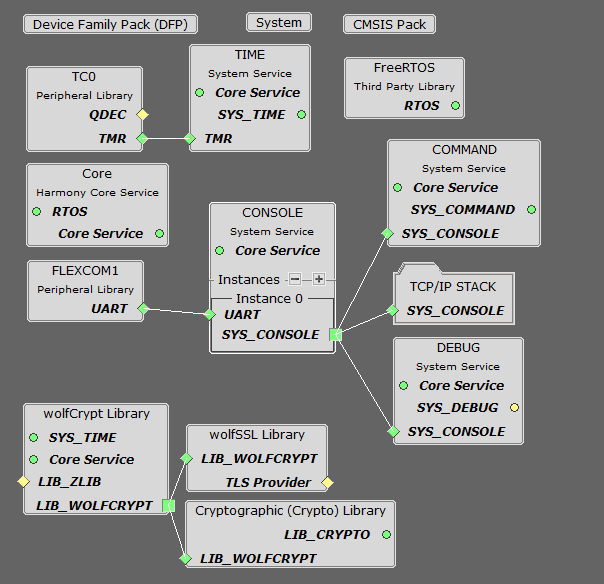
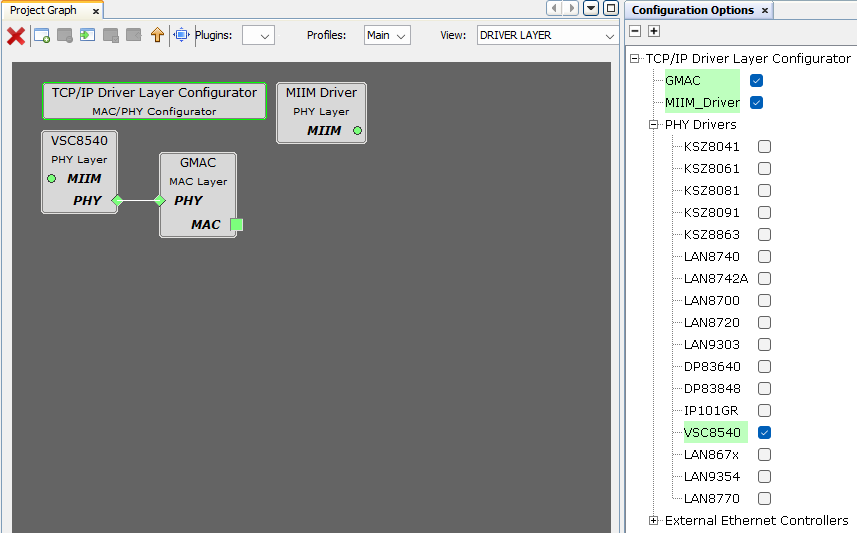
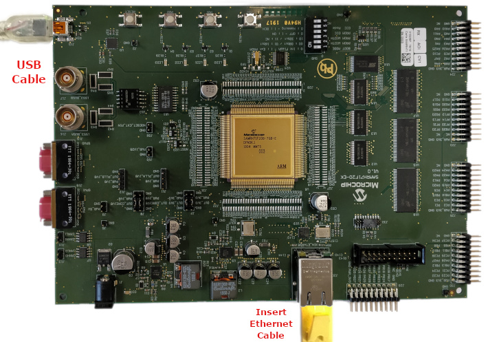
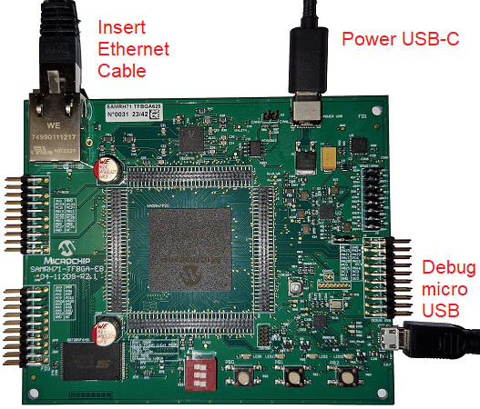
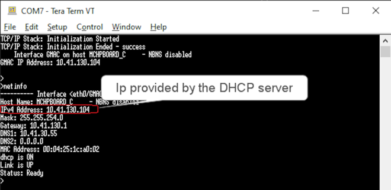
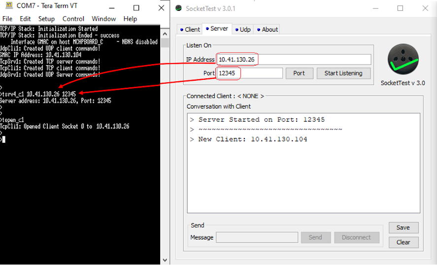

# TCP/IP TCP and UDP Client Server

The TCP/IP TCP & UDP Client Server configuration demonstrates creating a network client and a network server that uses both TCP and UDP socket APIs respectively.

**TCP/IP TCP and UDP Client Server MCC Configuration**

The following Project Graph diagram shows the Harmony components included in the TCP and UDP Client Server demonstration application.

-   MCC is launched by selecting **Tools \> Embedded \> MPLAB® Code Configurator** from the MPLAB X IDE, demo project is ready to be configured and regenerated.

-   **TCP/IP Root Layer Project Graph**

    The root layer project shows that FLEXCOM1 peripheral is selected to do read and write operation for TCP/IP commands.

    This is the basic configuration with SYS\_CONSOLE, SYS\_DEBUG and SYS\_COMMAND modules. These modules are required for TCP/IP command execution.

    

    **FreeRTOS** component is required for RTOS application.

    TCP sockets calculate the ISN using the wolfSSL crypto library.

-   **TCP/IP Required Application**

    TCP/IP demo use these application module components for this demo.

    **DHCP Client** module to discover the IPv4 address from the nearest DHCP Server.

    **DNS Client** provides DNS resolution capabilities to the stack.

    

-   **TCPIP Driver Layer**

    1.  For SAMRH71F20-EK Evaluation Kit: **Internal ethernet driver\(GMAC\)** is enabled with the external **KSZ8061 PHY driver** library.

        

    2.  For SAMRH71F20-TFBGA-EK Evaluation Kit: **Internal ethernet driver\(GMAC\)** is enabled with the external **VSC8540 PHY driver** library.

        

    The MIIM Driver supports asynchronous read/write and scan operations for accessing the external PHY registers and notification when MIIM operations have completed.

**TCP/IP TCP and UDP Client Server Hardware Configuration**

This section describes the required default hardware configuration for SAMRH71 Evaluation Kits that can be used for the respective application demonstration.

For initial setup, you can refer to the [Getting Started with SAMRH71F20 Evaluation Kit](https://ww1.microchip.com/downloads/en/AppNotes/Getting_Started_with_the_SAMRH71_Microcontroller_DS00003213C.pdf) application note.

1.  This section describes the required default hardware configuration to use SAMRH71F20-EK Evaluation Kit example:

    -   Set all SW5 DIP Switch to 0.

    -   Connect the mini USB cable from the computer to the J15 USB connector on the SAMRH71 Evaluation Kit

    -   Establish a connection between the router/switch with the SAMRH71 Evaluation Kit through the RJ45 connector

        

2.  This section describes the required default hardware configuration to use SAMRH71F20-TFBGA-EK Evaluation Kit example:

    -   Set all SW4 DIP Switch to 0.

    -   Connect the micro USB cable from the computer to the DEBUG USB connector on the SAMRH71 TFBGA Evaluation Kit

    -   Establish a connection between the router/switch with the SAMRH71 Evaluation Kit through the RJ45 connector

        

**TCP/IP TCP and UDP Client Server Running Application**

The Client Server configuration use combination of both TCP and UDP sockets for both client and server communication.

**MPLAB X IDE Project**

This table lists the name and location of the MPLAB X IDE project folder for the demonstration.

|Project Name|Target Device|Target Development Board|Description|
|------------|-------------|------------------------|-----------|
|sam\_rh71\_ek.X|ATSAMRH71F20C|SAMRH71F20-EK|Demonstrates the TCP/IP TCP and UDP Client Server on SAMRH71F20-EK development board. This implementation is based on FreeRTOS.|
|sam\_rh71\_tfbga.X|ATSAMRH71F20C|SAMRH71F20-TFBGA-EK|Demonstrates the TCP/IP TCP and UDP Client Server on SAMRH71F20-TFBGA-EK development board. This implementation is based on FreeRTOS.|

**Running The Demonstration**

1.  Build and download the demonstration project on the target board.

2.  Connect the board UART connection:

    1.  A virtual COM port will be detected on the computer, when the USB cable is connected to USB-UART connector.

    2.  Open a standard terminal application on the computer \(like Hyper-terminal or Tera Term\) and configure the virtual COM port.

    3.  Set the serial baud rate to 115200 baud in the terminal application.

    4.  See that the initialization prints on the serial port terminal.

    5.  When the DHCP client is enabled in the demonstration, wait for the DHCP server to assign an IP address for the development board. This will be printed on the serial port terminal.

        -   Alternatively: You can use the ping service to find the IP address of the board.

3.  Execution :

    1.  Once the demonstration starts executing, we can observe the current IP settings at the Tera Term terminal port.

    2.  Using "help" will display the available commands that can be used for this demo.

    3.  The application can create 4 separate connections, each one running in its own thread:

        -   A TCP client connection

        -   A TCP server connection

        -   A UDP client connection

        -   A UDP server connection

    4.  Each connection has its own set of commands.

        -   They can open or close the sockets, send messages to the socket they are connected to, they can display the received messages, etc.

        -   Use your preferred networking tools on the PC side \( netcat, Packet Sender, Hercules, python scripts, etc. \) to create sockets that talk to the ones opened by the client server application.

        -   This way you can exchange data with any/all of the communication threads that the demonstration creates.

    5.  After the successful board bring up, the console output becomes

        

    6.  For TCP Server test, the TCP Client application is required to run on the computer \(SocketTest, Packet Sender etc\). In this demonstration, we use the program, [SocketTest](http://sockettest.sourceforge.net/). This demonstration is tested with **SocketTest v3.0**.

        -   Open the TCP server socket by typing **topen\_s1** at the terminal console. This will display the listening port.

        -   Open the **SocketTest** software and set the configuration as shown in the following figure.

            

        -   Press the Connect button on the **SocketTest** software after setting the configuration. The serial terminal indicates that the connection has been established.

        -   Type any message in the message box of the **SocketTest** program, and press the Send button. The Server running on the development board will echo back the message to the **SocketTest** program.

            

    7.  For TCP Client test, the TCP Server application is required to run on the computer \(SocketTest, Packet Sender etc\). In this demonstration, we use the program, [SocketTest](http://sockettest.sourceforge.net/). This demonstration is tested with **SocketTest v3.0**.

        -   Open the **SocketTest** software and configure a TCP server by setting the computer IP address and a listening port. Then start the server by pressing **Start Listening** button.

        -   Set the TCP client options \(Address and port\) by using the **tsrv4\_c1** command at the terminal console as shown in the following figure.

            

        -   Open the TCP client socket by typing **topen\_c1** at the terminal console.

        -   Send messages to the TCP server by typing **tmsg\_c1** at the terminal console.

    8.  Similarly UDP Server test is also performed using **SocketTest** tool.

        -   Open the UDP server socket by typing **uopen\_s1** at the terminal console. This will display the listening port.

        -   Set the UDP client configuration in the **SocketTest** software, write any message and press the **Send** button. The Server running on the development board will echo back the message to the **SocketTest** program.

    9.  For UDP Client test, an UDP server in configured in **SocketTest** tool.

        -   Open the **SocketTest** software and configure a UDP server by setting the computer IP address and a listening port. Then start the UDP server by pressing **Start Listening** button.

        -   Set the UDP client options \(Address and port\) by using the **usrv4\_c1** command at the terminal console.

        -   Open the UDP client socket by typing **uopen\_c1** at the terminal console.

        -   Send messages to the UDP server by typing **umsg\_c1** at the terminal console.

**Parent topic:**[Harmony 3 TCP/IP Application for SAM RH71 Family](GUID-9F654EF7-6F64-4E62-98D9-7F1BDF366DE8.md)

