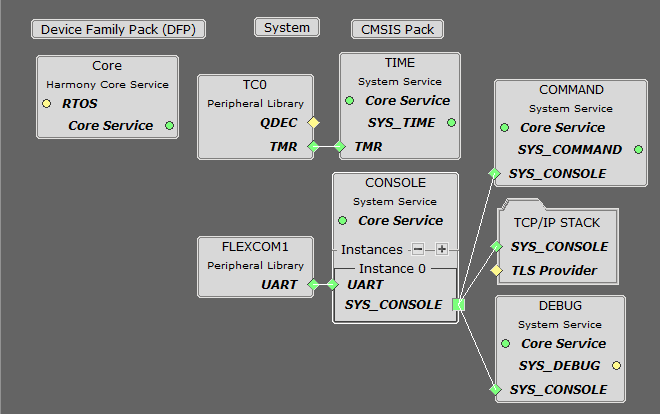
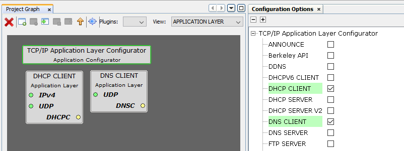

# TCP/IP UDP Client

The UDP Client configuration demonstrates creating a network Client with the API to make a UDP/IP connection to a specified port.

**TCP/IP UDP Client MCC Configuration**

The following Project Graph diagram shows the Harmony components included in this application demonstration.

-   MCC is launched by selecting **Tools \> Embedded \> MPLAB® Code Configurator** from the MPLAB X IDE, demo project is ready to be configured and regenerated.

-   **TCP/IP Root Layer Project Graph**

    The root layer project shows that FLEXCOM1 peripheral is selected to do read and write operation for TCP/IP commands.

    This is the basic configuration with SYS\_CONSOLE, SYS\_DEBUG and SYS\_COMMAND modules. These modules are required for TCP/IP command execution.

    

-   **TCP/IP Required Application**

    TCP/IP demo use these application module components for this demo.

    **DHCP Client** module to discover the IPv4 address from the nearest DHCP Server.

    **DNS Client** provides DNS resolution capabilities to the stack.

    

-   **TCPIP Driver Layer**

    **Internal ethernet driver\(GMAC\)** is enabled with the external **KSZ8061 PHY driver** library.

    

    The MIIM Driver supports asynchronous read/write and scan operations for accessing the external PHY registers and notification when MIIM operations have completed.

**TCP/IP UDP Client Hardware Configuration**

This section describes the required default hardware configuration for SAMRH71 Evaluation Kit that can be used for the respective application demonstration.

-   For initial setup, you can refer to the [Getting Started with SAMRH71F20 Evaluation Kit](https://ww1.microchip.com/downloads/en/AppNotes/Getting_Started_with_the_SAMRH71_Microcontroller_DS00003213C.pdf) application note.

-   Set all SW5 DIP Switch to 0.

-   Connect the micro USB cable from the computer to the J15 USB connector on the SAMRH71 Evaluation Kit

-   Establish a connection between the router/switch with the SAMRH71 Evaluation Kit through the RJ45 connector

    

**TCP/IP UDP Client Running Application**

**MPLAB X IDE Project**

This table lists the name and location of the MPLAB X IDE project folder for the demonstration.

|Project Name|Target Device|Target Development Board|Description|
|------------|-------------|------------------------|-----------|
|sam\_rh71\_ek.X|ATSAMRH71F20C|SAMRH71F20-EK|Demonstrates the TCP/IP UDP Client on development board with ATSAMRH71F20C device. This implementation is based on Bare Metal \( non-RTOS\).|

**Running The Demonstration**

1.  Build and download the demonstration project on the target board.

2.  Connect the board UART connection:

    1.  A virtual COM port will be detected on the computer, when the USB cable is connected to USB-UART connector.

    2.  Open a standard terminal application on the computer \(like Hyper-terminal or Tera Term\) and configure the virtual COM port.

    3.  Set the serial baud rate to 115200 baud in the terminal application.

    4.  See that the initialization prints on the serial port terminal.

    5.  When the DHCP client is enabled in the demonstration, wait for the DHCP server to assign an IP address for the development board. This will be printed on the serial port terminal.

        -   Alternatively: You can use the ping service to find the IP address of the board.

3.  Execution:

    **setopt**, **getopt** and **sendudp** are the UDP client APP commands.

    -   For UDP Client test, the UDP Server application is required to run on the computer \(SocketTest, Packet Sender etc\). This demonstration is tested with **[SocketTest v3.0](http://sockettest.sourceforge.net/)**.

    -   Set the UDP packet options by typing **setopt** at the terminal console.

    -   Verify the UDP packet settings by typing **getopt** at the terminal console.

    -   Open UDP Server application \(**SocketTest** software\) and select UDP server for the configured port number as per the command **setopt**.

    -   Send the UDP packet to the destination using the **sendudp** command.

    -   After the **sendudp** command is input, the demonstration will make a DNS query to look up the host name and send a UDP packet to that host.

    -   The output message will be received by the UDP server on the port that is configured by the command **setopt**.

**Parent topic:**[Harmony 3 TCP/IP Application for SAM RH71 Family](GUID-9F654EF7-6F64-4E62-98D9-7F1BDF366DE8.md)

