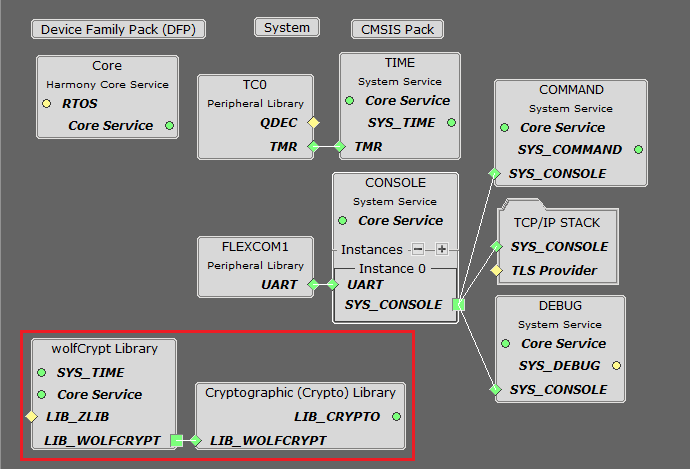

# TCP/IP Berkeley TCP Server

The Berkeley TCP Server configuration demonstrates creating a creating a network server that uses the Berkeley API to create a TCP/IP echo server on port 9760.

**TCP/IP Berkeley TCP Server MHC Configuration**

The following Project Graph diagram shows the Harmony components included in the TCP Server demonstration application.

-   MHC is launched by selecting **Tools \> Embedded \> MPLAB® Harmony 3 Configurator** from the MPLAB X IDE, demo project is ready to be configured and regenerated.

-   **TCP/IP Root Layer Project Graph**

    The root layer project shows that FLEXCOM1 peripheral is selected to do read and write operation for TCP/IP commands.

    This is the basic configuration with SYS\_CONSOLE, SYS\_DEBUG and SYS\_COMMAND modules. These modules are required for TCP/IP command execution.

    

-   **TCP/IP Required Application**

    TCP/IP demo use these application module components for this demo. **Announce** module to discover the Microchip devices within a local network.

    **DHCP Client** module to discover the IPv4 address from the nearest DHCP Server.

    **DNS Client** provides DNS resolution capabilities to the stack.

    **Berkeley API** module provides the Berkeley\_Socket\_Distribution \(BSD\) wrapper to the native Microchip TCP/IP Stack APIs. During this component selection, the required transport and network modules are also selected.

    

-   **TCPIP Driver Layer**

    **Internal ethernet driver\(GMAC\)** is enabled with the external **KSZ8061 PHY driver** library.

    

    The MIIM Driver supports asynchronous read/write and scan operations for accessing the external PHY registers and notification when MIIM operations have completed.

**TCP/IP Berkeley TCP Server Hardware Configuration**

This section describes the required default hardware configuration for SAM RH71 Evaluation Kit that can be used for the respective application demonstration.

-   For initial setup, you can refer to the [Getting Started with SAMRH71F20 Evaluation Kit](https://ww1.microchip.com/downloads/en/AppNotes/Getting_Started_with_the_SAMRH71_Microcontroller_DS00003213C.pdf) application note.

-   Set all SW5 DIP Switch to 0.

-   Connect the micro USB cable from the computer to the J15 USB connector on the SAM RH71 Evaluation Kit

-   Establish a connection between the router/switch with the SAM RH71 Evaluation Kit through the RJ45 connector

    

**TCP/IP Berkeley TCP Server Running Application**

**MPLAB X IDE Project** This table list the name and location of the MPLAB X IDE project folder for the demonstration.

|Project Name|Target Device|Target Development Board|Description|
|------------|-------------|------------------------|-----------|
|sam\_rh71\_ek.X|ATSAMRH71F20C|SAMRH71F20-EK|Demonstrates the Berkeley TCP Server on development board with ATSAMRH71F20C device. This implementation is based on Bare Metal \( non-RTOS\).|

**Running The Demonstration**

1.  Build and download the demonstration project on the target board.

2.  Connect the board UART connection:

    1.  A virtual COM port will be detected on the computer, when the USB cable is connected to USB-UART connector.

    2.  Open a standard terminal application on the computer \(like Hyper-terminal or Tera Term\) and configure the virtual COM port.

    3.  Set the serial baud rate to 115200 baud in the terminal application.

    4.  See that the initialization prints on the serial port terminal.

    5.  When the DHCP client is enabled in the demonstration, wait for the DHCP server to assign an IP address for the development board. This will be printed on the serial port terminal.

3.  Alternatively:

    1.  When the DHCP client is enabled in the demonstration, wait for the DHCP server to assign an IP address for the development board.

    2.  Use the Announce service or ping to get the IP address of the board.

4.  Test:

    1.  As soon as a valid IP address is assigned through the DHCP to the demonstration, it is ready to accept a TCP/IP connection on port 9760.

    2.  Send a TCP packet to the IP address of the hardware board using port 9760 from any TCP Client application running on the computer \(SocketTest, Packet Sender etc\).

    3.  The TCP Server demonstration running on the evaluation kit will echo back everything it receives along the connection.

**Parent topic:**[Harmony 3 TCP/IP Application for SAM RH71 Family](GUID-9F654EF7-6F64-4E62-98D9-7F1BDF366DE8.md)

